# 🎨 NFT Marketplace Multi-Collection

[](https://soliditylang.org/)
[](https://getfoundry.sh/)
[](https://openzeppelin.com/contracts/)
[](https://opensource.org/licenses/MIT)

Un Smart Contract descentralizado, seguro y eficiente en consumo de gas para el intercambio de tokens no fungibles (NFTs) desarrollado con **Foundry** y **Solidity 0.8.28**. Permite a los usuarios listar, comprar y cancelar la venta de NFTs basados en el estándar **ERC-721** pertenecientes a múltiples colecciones mediante pagos directos en ETH.

---

## 📋 Tabla de Contenidos

- [Características Principales](#-características-principales)
- [Arquitectura del Contrato](#-arquitectura-del-contrato)
- [Estructura del Proyecto](#-estructura-del-proyecto)
- [Seguridad y Buenas Prácticas](#-seguridad-y-buenas-prácticas)
- [Requisitos Previos](#-requisitos-previos)
- [Instalación y Configuración](#-instalación-y-configuración)
- [Compilación y Pruebas](#-compilación-y-pruebas)
- [Guía de Interacción (Funciones)](#-guía-de-interacción-funciones)
- [Despliegue](#-despliegue)
- [Licencia](#-licencia)

---

## 🚀 Características Principales

- **Soporte Multi-Colección:** Compatible con cualquier contrato que implemente el estándar ERC-721 (`IERC721`).
- **Listado Seguro:** Valida en tiempo real que el usuario sea el legítimo propietario y que haya otorgado la aprobación requerida (`approve` o `setApprovalForAll`) al marketplace.
- **Compra Atómica y Segura:** 
  - Transferencia directa de fondos en ETH al vendedor.
  - Transferencia segura del NFT al comprador mediante `safeTransferFrom`.
  - Protección estricta frente a ataques de reentrada (`ReentrancyGuard`).
  - Implementación del patrón de diseño **Checks-Effects-Interactions (CEI)**.
- **Cancelación Flexible:** El vendedor puede cancelar su listado en cualquier momento previo a la venta.
- **Eventos Indexables:** Emisión de eventos detallados (`addListingNft`, `cancelledNFT`, `soldNft`) para facilitar la indexación mediante subgraphs u oráculos frontend.

---

## 🏛 Arquitectura del Contrato

### Estructura de Datos (`Listing`)

Cada listado de NFT se indexa mediante la dirección de su contrato de colección y su identificador de token (`mapping(address => mapping(uint256 => Listing))`):

```solidity
struct Listing {
    address seller;      // Dirección del vendedor
    address nftAddress;  // Dirección del contrato de la colección ERC-721
    uint256 tokenId;     // ID único del NFT
    uint256 price;       // Precio de venta en wei
}
```

### Flujo de Interacción

```mermaid
sequenceDiagram
    autonumber
    actor Vendedor as Vendedor
    actor Comprador as Comprador
    participant NFT as Contrato ERC-721
    participant Marketplace as NFTMarketPlaceMultiCollection

    Note over Vendedor,Marketplace: 1. Proceso de Listado
    Vendedor->>NFT: approve(Marketplace, tokenId)
    Vendedor->>Marketplace: listNft(nftAddress, tokenId, price)
    Marketplace-->>Marketplace: Valida propiedad & aprobación
    Marketplace-->>Marketplace: Guarda Listing & emite addListingNft

    Note over Comprador,Marketplace: 2. Proceso de Compra
    Comprador->>Marketplace: buyNft{value: price}(nftAddress, tokenId)
    Marketplace-->>Marketplace: Verifica existencia & precio exacto
    Marketplace-->>Marketplace: [Effect] Elimina listing
    Marketplace->>Vendedor: [Interaction] Envía ETH (call)
    Marketplace->>NFT: [Interaction] safeTransferFrom(seller, comprador, tokenId)
    Marketplace-->>Marketplace: Emite soldNft
```



---

## 📁 Estructura del Proyecto

```text
NFTMarcketPlace/
├── .gitmodules                 # Configuración de submódulos Git
├── foundry.toml                # Configuración global de Foundry
├── lib/
│   ├── forge-std/              # Biblioteca estándar de pruebas de Foundry
│   └── openzeppelin-contracts/ # Contratos estándar seguros de OpenZeppelin
├── src/
│   └── NTFMarcketPlace.sol     # Contrato principal NFTMarketPlaceMultiCollection
├── test/
│   └── NTFMock.t.sol           # Suite de pruebas unitarias y contrato MockNFT
└── README.md                   # Documentación del proyecto
```

---

## 🔒 Seguridad y Buenas Prácticas

1. **Checks-Effects-Interactions (CEI):** En la función `buyNft`, el listado se elimina del almacenamiento (`delete listings[...]`) antes de realizar la transferencia de ETH y la transferencia del token NFT.
2. **Prevención de Reentrada:** Se utiliza `nonReentrant` de OpenZeppelin (`ReentrancyGuard`) para blindar las transferencias contra posibles llamadas recurrentes.
3. **Validación de Parámetros:**
   - Precios deben ser mayores a cero (`NotPermitValue`).
   - El listador debe ser dueño comprobado del token (`checkOwnerNft`).
   - El contrato debe contar con permisos explícitos de transferencia (`checkApproveToken`).
   - El monto pagado en ETH debe ser exactamente igual al precio establecido.
4. **Transferencias Seguras de NFTs:** Uso de `safeTransferFrom` para evitar la pérdida accidental de tokens enviados a contratos que no implementen `IERC721Receiver`.

---

## 📦 Requisitos Previos

Asegúrate de tener instalados los siguientes componentes:

- [Git](https://git-scm.com/)
- [Foundry](https://book.getfoundry.sh/getting-started/installation) (Forge, Cast, Anvil)

> [!NOTE]
> En entornos Windows, se recomienda ejecutar los comandos de Foundry desde **Git Bash**.

---

## ⚙️ Instalación y Configuración

1. **Clonar el repositorio con sus submódulos:**

   ```bash
   git clone https://github.com/JPeralta-dev/NFTMarcketPlace.git
   cd NFTMarcketPlace
   ```

2. **Inicializar o actualizar dependencias:**

   Si clonaste el repositorio sin submódulos, ejecuta:

   ```bash
   git submodule update --init --recursive
   ```

---

## 🧪 Compilación y Pruebas

### Compilación de Smart Contracts

Para compilar los contratos y generar los artefactos:

```bash
forge build
```

### Ejecución de Pruebas Unitarias

El proyecto cuenta con una batería de pruebas completa en `test/NTFMock.t.sol`:

```bash
# Ejecutar todas las pruebas
forge test

# Ejecutar con mayor nivel de detalle (trazas de ejecución)
forge test -vvv

# Ejecutar una prueba específica
forge test --match-test testWhenCanCorrectlPay -vvv
```

### Casos de Prueba Implementados

| Caso de Prueba | Descripción | Estado |
|---|---|:---:|
| `testMintNft` | Acuñado y propiedad inicial del MockNFT | ✅ |
| `testSholdRevertIfPriceZero` | Revert al intentar listar con precio igual o menor a 0 | ✅ |
| `testShoultRevertIdNotOwner` | Revert si un usuario no propietario intenta listar | ✅ |
| `testListingCorrectly` | Registro correcto del listado y verificación del mapping | ✅ |
| `testListShouldRevertIfNotOwner` | Revert si un usuario ajeno intenta cancelar un listado | ✅ |
| `testCancelListShouldCorrectly` | Cancelación de listado y eliminación del estado | ✅ |
| `testBuyNftShouldDontExist` | Revert si se intenta comprar un NFT que no está listado | ✅ |
| `testCantNotWithIncorrectPay` | Revert si el valor enviado en ETH no coincide con el precio | ✅ |
| `testWhenCanCorrectlPay` | Flujo exitoso de compra, transferencia de ETH y de NFT | ✅ |

### Reportes de Gas y Formato

```bash
# Generar instantánea de consumo de gas
forge snapshot

# Validar y formatear código Solidity
forge fmt
```

---

## 📖 Guía de Interacción (Funciones)

### 1. Listar un NFT (`listNft`)

```solidity
function listNft(address nftAdress_, uint256 tokenId_, uint256 price_) external
```
- **Requisitos:** El llamante debe ser el dueño del `tokenId_`, haber aprobado previamente al marketplace y definir un `price_ > 0`.

### 2. Comprar un NFT (`buyNft`)

```solidity
function buyNft(address nftAdress_, uint256 tokenId_) external payable
```
- **Requisitos:** El NFT debe estar previamente listado. El valor enviado (`msg.value`) debe ser idéntico al precio del listado.

### 3. Cancelar un Listado (`cancelNft`)

```solidity
function cancelNft(address nftAdress_, uint256 tokenId_) external
```
- **Requisitos:** Solo la dirección que listó el NFT (`seller`) puede cancelar la publicación.

---

## 🌐 Despliegue

### Despliegue en red local (Anvil)

1. En una terminal, inicia el nodo local:
   ```bash
   anvil
   ```

2. En otra terminal, despliega el contrato utilizando `forge create`:
   ```bash
   forge create src/NTFMarcketPlace.sol:NFTMarketPlaceMultiCollection \
     --rpc-url http://127.0.0.1:8545 \
     --private-key <TU_PRIVATE_KEY_DE_ANVIL>
   ```

### Despliegue en Testnet (ej. Sepolia)

```bash
forge create src/NTFMarcketPlace.sol:NFTMarketPlaceMultiCollection \
  --rpc-url <TU_RPC_URL> \
  --private-key <TU_PRIVATE_KEY> \
  --etherscan-api-key <TU_ETHERSCAN_API_KEY> \
  --verify
```

---

## 📄 Licencia

Este proyecto está bajo la licencia **MIT**. Consulta el archivo `LICENSE` o los encabezados SPDX para más información.
